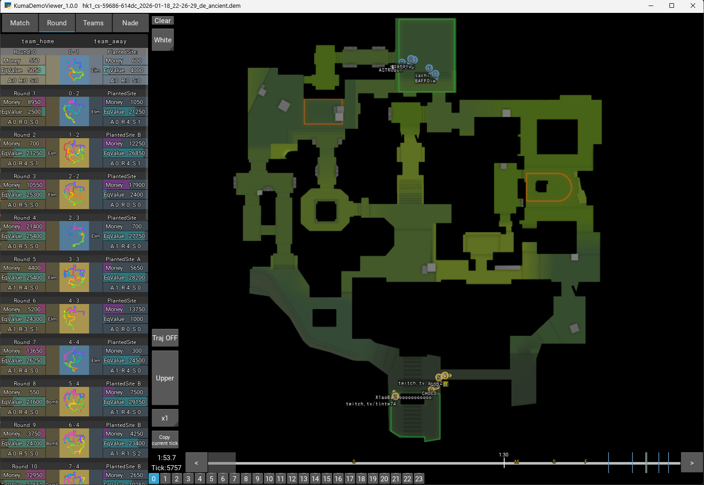

# KDV (KumaDemoViewer)

[English](README.md) | [日本語](README.ja.md)



Counter-Strike 2 のデモファイル向け Kivy ビューアーです。バンドルされている Go パーサーが
`.dem` を `.kdz` に変換し、ラウンド・プレイヤー・ユーティリティ・イベントを可視化します。

## サポート
- Ko-fi: https://ko-fi.com/kieee

## 機能
### 入力と変換
- アプリのウィンドウに `.dem` / `.kdz` をドラッグ&ドロップして読み込み。
- バンドル済み Go パーサーで CS2 `.dem` を `.kdz` に変換。
- 変換した `.kdz` を元の `.dem` と同じディレクトリに保存。
- 同じフォルダに同名 `.kdz` が存在し、かつそのバージョンがアプリと一致する場合は、パースをスキップして既存 `.kdz` を読み込みます。
- 既存 `.kdz` のバージョンがアプリと異なる場合は自動で再パース。
- `.kdz` は zip 圧縮された msgpack データ形式（`kdm_header`, `kdm_matchstats`, `kdm_round_*`）。
- `kdv/kdv_config.json` で起動時の既定値（UI トグルやマップ補正値）を設定可能。

### ラウンド・タイムライン操作
- ラウンド一覧で、スコア・設置サイト・経済・装備数・勝利理由を表示。
- 下部のクイックラウンドボタンで直接ラウンドジャンプ。
- シークバーに 1:30 / 1:00 / 0:30 マーカーを表示。
- シークバーに Kill マーカー（T / CT）を表示。
- シークバーにボム設置マーカー（設置サイト付き）を表示。
- シークバーにユーティリティ投擲マーカーを表示。
- 再生操作（再生/停止、シーク、前ラウンド/次ラウンド）。
- 再生速度（`x1/2`, `x1`, `x2`, `x4`）。
- キーボードで 3 秒単位のステップ移動。
- シークバー右クリックでブックマーク登録、`B` キーで復帰。
- タイマー/ティック表示エリアをクリックして、現在 tick のコマンド（`demo_gototick <tick>`）をクリップボードへコピー。

### マップと戦術可視化
- プレイヤー位置、向き、アクティブ武器表示、射線、フラッシュ状態を描画。
- 死亡プレイヤーの Last Alive 位置を表示。
- C4 の状態（所持・設置・爆発・解除）を表示。
- グレネードの軌跡と効果範囲（HE/Flash/Smoke/Molotov/Incendiary/Decoy）を描画。
- スモーク残り時間リングを描画。
- ラウンド軌跡オーバーレイをレーダー上に重ねて表示可能。
- 多層マップ（`de_nuke`, `de_vertigo`）で Upper/Lower 切り替え。
- プレイヤー表示トグル（武器アイコン、番号、HPバー、名前、視線、ユーティリティ）。

### ユーティリティとイベント
- Nade タブで投擲情報（時刻、tick、投擲者、種類、しゃがみ投擲）を一覧表示。
- Nade エントリをクリックして該当スナップショットへジャンプ。
- 投擲位置/角度コマンド（`setpos ...;setang ...`）をクリップボードにコピー。
- Event ログパネルで Kill / Utility / Plant / Defuse を時系列表示。

### 注釈と操作
- 右ドラッグでマップ上に描画。
- 描画色切り替え（`White`, `Orange`, `Blue`）。
- ボタンまたは `C` キーで描画クリア。
- `F11` でフルスクリーン切り替え。

### キーボードショートカット
- `Space`: 再生/停止
- `Left` / `A`: 3 秒戻る
- `Right` / `D`: 3 秒進む
- `Up` / `W`: 前ラウンド
- `Down` / `S`: 次ラウンド
- `1` / `2` / `4` / `3` (`H`/`5`): 再生速度プリセット
- `V`: 視線表示トグル
- `G`: ユーティリティ表示トグル
- `B`: ブックマーク位置へジャンプ
- `T`: 軌跡オーバーレイトグル
- `Tab`: タブ切り替え
- `Left Ctrl`: マップレイヤー切り替え

## 要件
- Python 3.10（`kdv/.python-version` を参照）
- `kdv/requirements.txt` の Python 依存関係
- Go（`kdv_parser.exe` のビルドに必要）

## セットアップ
以下を実行:

```bat
.\build.bat
```

このスクリプトで以下を実行します:
- `kdv/.venv` の作成/利用
- Python 依存関係のインストール
- `kdv/kdv_parser.exe` のビルド
- PyInstaller による `kdv/kdv.exe` のビルド

## 実行
セットアップ後、以下を起動:

```bat
kdv\kdv.exe
```

重要:
- `kdv.exe` の実行には、実行ファイルと同じディレクトリに `img/`、`maps/`、`kdv_config.json` が必要です。
- ビルド成果物を移動・配布する場合も、これらを `kdv.exe` と同じ階層に配置してください。

## 設定 (`kdv/kdv_config.json`)
- `kdv/kdv_config.json` を編集して、UI 初期値やマップ補正値を変更できます。
- 変更はアプリ起動時に反映されます（編集後は KDV を再起動）。
- `ui_setting`: Teams タブのオーバーレイ表示チェックボックスの既定値。
- `ui_setting.weapon_icon`: アクティブ武器テキスト表示の既定値。
- `ui_setting.player_number`: プレイヤー番号表示の既定値。
- `ui_setting.hpbar`: HP バー表示の既定値。
- `ui_setting.player_name`: プレイヤー名表示の既定値。
- `ui_setting.sightline`: 視線表示の既定値。
- `ui_setting.utility_icon`: 所持ユーティリティ表示の既定値。
- `kdv_scale_map`: マップごとの初期スケール（UI ズーム基準）。
- `kdv_gap_map`: マップごとの表示オフセット `(x, y)`。
- `kdv_gap_map.default`: マップ設定がない場合のフォールバックオフセット。
- `map_bounds`: 多層マップのレイヤー判定/調整に使う境界値。
- `map_bounds.nuke_bdr`: Nuke の Upper/Lower 判定に使う Z 境界。
- `map_bounds.vertigo_z_bdr`: Vertigo の Upper/Lower 判定に使う Z 境界。
- `map_bounds.nuke_y_bdr`: Nuke 境界調整用の予約値。
- `map_bounds.vertigo_a_x_bdr`: Vertigo 境界調整用の予約値。
- `map_bounds.vertigo_b_x_bdr`: Vertigo 境界調整用の予約値。
- `map_bounds.vertigo_b_y_bdr`: Vertigo 境界調整用の予約値。

## 補足
- `.dem` をパースするには `kdv/kdv_parser.exe` が必要です。
- パーサーを手動ビルドする場合:

```bat
cd kdv_parser\cmd\parser
go build -o ..\..\..\kdv\kdv_parser.exe main.go
```

- Go を最新に保つと、アンチウイルスの誤検知を減らせる場合があります。
- サードパーティフォントライセンス: `kdv/img/IPA_Font_License_Agreement_v1.0.txt`
- サードパーティ表記: `THIRD_PARTY_NOTICES.txt` と `third_party_licenses/`
- プロジェクトライセンス: MIT（`LICENSE`）
- レーダー画像はこのリポジトリに同梱していません。`kdv/maps` に手動配置してください。

## レーダー画像
- レーダー画像はこのリポジトリに含まれていません。
- `kdv/maps` に手動で追加してください。
- CS2 のゲームファイルから抽出する場合は以下を参照:
  https://cs-demo-manager.com/docs/guides/maps#radars-optional
- 必須フォーマット: 1024x1024 PNG
- 命名: `de_<mapname>.png`
- 下層マップ命名: `de_<mapname>_lower.png`（例: `nuke`, `vertigo`）
